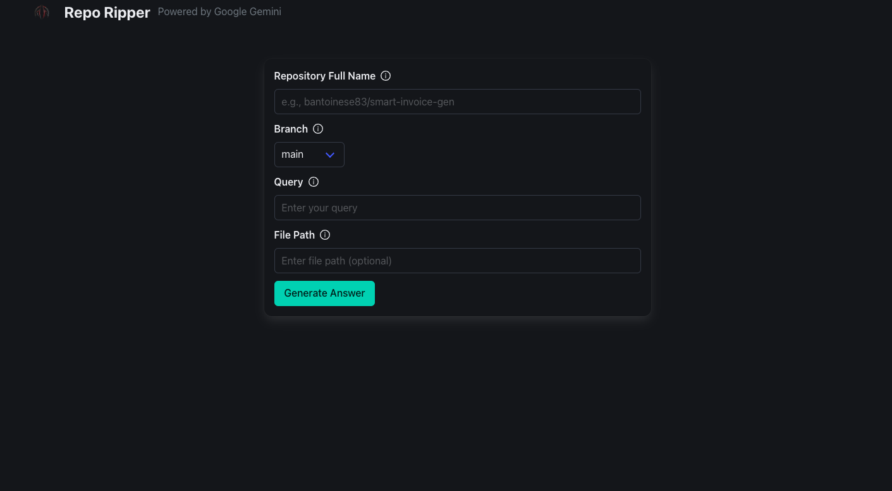

## RepoRipper: Your AI-Powered Codebase Assistant

RepoRipper is a powerful application that leverages the power of large language models (LLMs) to help you understand and
work with your codebases more effectively.

**Key Features:**

- **AI-Driven Code Generation:** Get code suggestions and complete functions based on natural language queries. Just ask
  RepoRipper what you need, and let the AI do the work!
- **Repository Exploration:** Easily browse and search through your GitHub repositories.
- **Code Insights:** Gain deeper insights into your code by asking questions about its functionality.
- **Efficient Workflow:** Seamlessly integrate AI-generated code into your development process.

**How it Works:**

1. **Authenticate:** Securely log in using your credentials or your Google account.
2. **Search Your Repositories:** Find the GitHub repository you want to work with.
3. **Ask Your Question:** Describe the code you need in natural language (e.g., "Write a function to sort a list of
   numbers in descending order").
4. **Generate Code:** RepoRipper uses a powerful LLM to generate the code for you.
5. **Copy, Edit, and Integrate:** Copy the generated code, edit it as needed, and paste it into your project.

**Benefits:**

- **Increased Productivity:** Spend less time writing boilerplate code and more time on the core logic of your
  application.
- **Enhanced Code Quality:** Get suggestions and code that aligns with best practices.
- **Reduced Errors:** LLMs can help avoid common coding mistakes.
- **Learning Tool:** Use RepoRipper to learn new coding concepts and techniques.

**Getting Started:**

1. **Clone the Repository:**

```
git clone https://github.com/bantoinse83/RepoRipper.git
```
```
cd RepoRip_v1
```
```
cd client
```
```
npm install
```

```
cd server
```
```
pip install -r requirements.txt
```
2. **Set Up Environment Variables:** Create a `.env` file in the `server` directory and add the following variables:

```
JWT_SECRET_KEY=your_secret_key
JWT_ALGORITHM=HS256  # Or your preferred algorithm
GOOGLE_CLIENT_ID=your_google_client_id
GEMINI_API_KEY=your_gemini_api_key
```

 